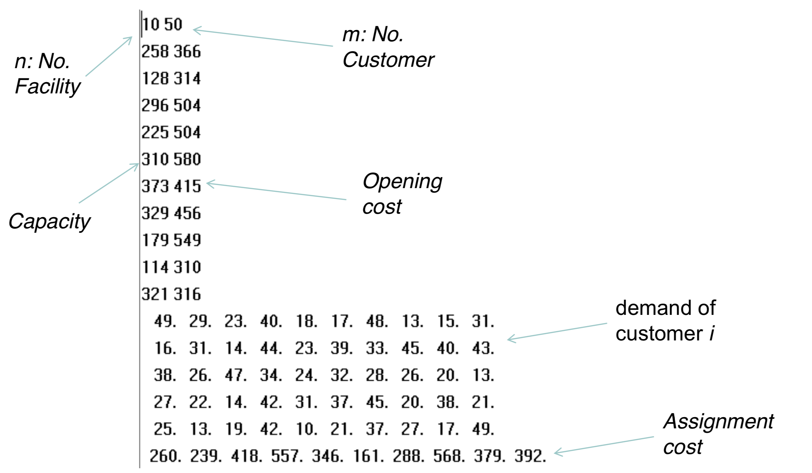
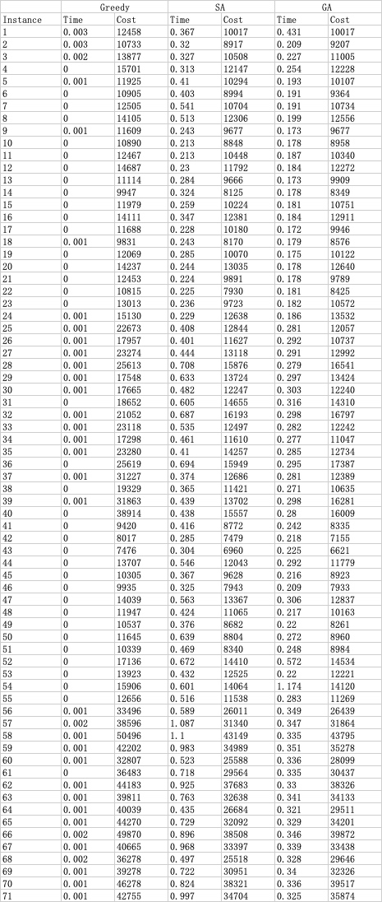

# Capacitated Facility Location Problem

### 问题描述
假设有n个设施和m个客户。 我们希望选择：

1. 开放的n个设施中的哪一个
2. 将客户分配给设施
3. 目标是尽量减少开放成本和分配成本之和。
4. 分配给设施的总需求量不得超过其容量。

### 问题测例

一共有71个测试用例，各个用例的格式如下




### 问题建模

根据上面的题目要求，我们可以首先建的数据模型如下

$x_{ij} = \begin{cases}
1&\text{如果顾客j由工厂i服务}\\
0&\text{otherwise}
\end{cases}$

$d_j = 用户j的需求量$

$c_{ij} = \text{顾客j商品交由i工厂处理的cost}$

$y_i = 仓库i是否开启$

$f_i = 开启仓库的代价$

$b_i = 仓库的容量$


总体Cost
$$Sum_{cost} = \sum_{i=1}^n\sum_{j=1}^mc_{ij}x_{ij} + \sum_{i=1}^nf_iy_i$$

$$Ans = min(Sum_{cost})$$


限制条件

$\sum_{i=1}^nx_{ij}=1\quad \forall j \quad \text{一个顾客只分配给一个工厂}$
$\sum_{j=1}^md_jx_{ij} \leq b_iy_i \quad \forall i \quad \text{分配给设施的总需求量不得超过其容量} $

### 具体分析

首先，对于这种np难的问题，显然我们是不可能去通过穷举求得其最优解的，所以，我们希望的是通过我们在算法课程以及人工智能课程上的优化算法对该问题进行求解。

本来在上面建完模型之后，在这种目标函数以及问题约束十分清晰的条件下，我一开始想到的是把其当成线性优化对其进行求解，但是经过初步操作之后发现其在规模不大的测例中表现良好，但是一旦参数过多，其计算时间就会变得十分久，当变量非常多时,使用该问题求解，求解节点会指数速度增加，某些解花费大量时间也求不出解来。

所以这里我们先说说我们这里用到的三种主要的算法，再简单说说线性优化的实现

#### 具体代码
具体代码可在src文件夹中查看

#### 贪心算法
首先，我们这里尝试使用贪心算法对我们的问题进行求解，这里我们先简单讲讲我们的算法，我的贪心算法就是维护一个已开启的工厂列表以及一个未开启的工厂列表，每次分别对于已开启的工厂列表和未开启的工厂列表中每个工厂i取对应$min(c_{ij})$即最小的顾客j商品交由i工厂处理的cost，分别取得结果后，我们取$min(c_{i_{open}j}, c_{i_{close}j} + f_i)$即比较 最小的直接使用已开启工厂的开销 以及 最小的使用未使用工厂的开销+打开未使用工厂的开销之间的最小值

取得了最小值对应用户以及工厂的index后，若是工厂满足用户需求，则我们将用户的需求加到factory的used上，并将用户置为不可用，即把其对应使用工厂的开销全部设置为Double.MAX_VALUE。否则若是用户的需求超出其容量，则我们选择将工厂置为不可用，同理，将其对应用户的开销全部变为Double.MAX_VALUE

通过这样的贪心算法我们可以较快得到一个还可以的的解


#### 模拟退火算法
这里我使用的是一个人工智能中一个项目中用到的模拟退火算法，通过模拟退火算法，我们对上面贪心算法中得到的结果进行再优化

这里我们说说我们的模拟退火算法，其算法核心(Annealing)的伪代码如下

```java
currentSolution = initial_solution() //这里我们使用贪心算法对解进行初始化
while (currentTemperature > minTemperature) {
    for (int i = 0; i < internalLoop; i++) {
        // 通过多邻域操作获得新解
        newSolution = generateNeighourResult();
        // 获得新解的cost
        double currentEnergy = currentSolution.cost;
        double neighbourEnergy = newSolution.cost;

        // 根据概率查看是否接收新解作为startPoint
        if (acceptanceProbability(currentEnergy, neighbourEnergy,
                currentTemperature) > Math.random()) {
            currentSolution = newSolution;
        }

        //若当前解优于最优解，更新bestSolution
        if (currentSolution.cost < bestSolution.cost) {
            bestSolution = new Solution(currentSolution.customerDemand.clone(), currentSolution.cost);
        }
    }
    currentTemperature *= coolingRate; // 降温
}
```

除了上面Annealing的算法，模拟退火中较为关键的还是其领域操作的设计，通过较好设计我们的领域操作，我们就可以使我们的解不断跳出局部最优解，进而得到一个更好的解，这里我使用了4种局部操作，这里比较关键的是第四种局部操作，因为我们通过贪心得到的算法基本已经处在打开同样工厂的解中的较好的位置，简单通过交换用户指派的工厂其实难以得到一个较好的解，通过我们第四种领域操作，我们就可以改变分配的工厂，从工厂维度跳出局部最优，是比较关键的一步

```
// 简单交换两个顾客指派的工厂
changeDemandFactory()
// 逆序交换一段顾客指派的工厂
reverseDemands()
// 前后交换两个范围的顾客指派的工厂
swapTwoSegment()
// 对用户指派的工厂直接进行变异, 
// 不止调整用户指派的工厂，
// 从工厂维度跳出局部最优(关键)
variation()
```

而领域操作的选择则是采用了之前做人工智能项目时老师给的建议，在多种领域操作中随机选择一种领域操作，而因为我们这里较为特殊需要验证解的有效性，所以领域操作得到的新解有可能不可用，需要重新生成新解，这里就通过一个while循环来解决该问题

```java
 public Solution generateNeighourResult() {
    Solution tmp = null;
    while (tmp == null) {
        int opt = (int) (4 * Math.random());
        switch (opt) {
            case 0:
                tmp = changeDemandFactory();
                break;
            case 1:
                tmp = reverseDemands();
                break;
            case 2:
                tmp = swapTwoSegment();
                break;
            case 3:
                tmp = variation();
                break;
        }
    }
    return tmp;
}
```
#### 遗传算法
除了模拟退火算法这种单点搜索算法之外，像遗传算法这种多点搜索算法也可以应用到我们的求解当中。

遗传算法的基本步骤如下

1. 根据群体大小，初始化群体(这里做了个优化，一开始用贪心算法生成初始解加入到初始群体中)
2. 对各个个体进行评价，计算适应度
3. 从群体中通过选择算子选择父母亲
4. 对父母亲进行交叉得到新群体
5. 将变异操作应用到群体中
6. 选择下一代
7. 判断是否达到结束代数，未达到则返回2步继续执行，否则跳出循环

在我的算法中具体为下

```java
public void genetic() {
    for (int i = 0; i < this.inheritance_number; i++) {
        this.oneGenetic(i + 1); //遗传一代
    }
}

private void oneGenetic(int geneticNumber) {
    this.sonSolutions = new ArrayList<>();
    this.hybridization(); //杂交(包含选择)
    this.mutation(); //变异一次
    this.updateEntity();  //选择(包含计算适应度)
    this.chooseBest(geneticNumber); //择优
}
```
这里的选择我采用的是轮盘赌算法，而除此之外我个人还加入了精英保留策略，保证算法可以收敛

交叉部分则较为简单，就是随机选取index1和index2，交换父母的这部分，并查看是否合法，若是一次未生成两个valid子代，继续执行，最多运行10次

```java
/***
 * 交叉函数
 */
public List<Solution> swap(Solution father, Solution mother) {
    List<Solution> result = new ArrayList<>();
    int count = 0;
    while (count < 10 && result.size() < 2) {    // 若未生成两个valid子代，继续执行，最多运行10次
        int index1 = (int) (instance.customerNum * Math.random());
        int index2 = (int) (instance.customerNum * Math.random());
        while (index1 == index2) {
            index1 = (int) (instance.customerNum * Math.random());
            index2 = (int) (instance.customerNum * Math.random());
        }
        if (index1 > index2) {
            int tmp = index1;
            index1 = index2;
            index2 = tmp;
        }
        int[] fatherClone = father.customerDemand.clone();
        int[] motherClone = mother.customerDemand.clone();
        for (int i = index1; i <= index2; i++) {
            fatherClone[i] = mother.customerDemand[i];
            motherClone[i] = father.customerDemand[i];
        }
        double fatherCost = instance.valid(fatherClone);
        double motherCost = instance.valid(motherClone);
        if (fatherCost != -1) {
            result.add(new Solution(fatherClone, fatherCost));
        }
        if (motherCost != -1) {
            result.add(new Solution(motherClone, motherCost));
        }
        ++count;
    }
    return result;
}
```


变异部分则是随机选取一个顾客，改变他的分配的工厂

```java
/***
 * 变异函数
 */
public void oneVariable(Solution solution) {
    int index = (int) (instance.customerNum * Math.random());
    int factoryIndex = (int) (instance.factoryNum * Math.random());
    solution.customerDemand[index] = factoryIndex;
}
```

到这里遗传算法基本完成


### 比较算法结果
分别的对应每种算法的具体结果(带工厂状态和顾客分配结果)可以在result文件夹下看到

可以看到单纯贪心算法的耗时十分之少，有些简单的测例甚至显示time为0, 但是其求出的解显然不是较优解，SA和GA从结果上比较，各有千秋，但是显然通过优化算法求解，我们的解要比贪心算法求出的解好上不少。

从我们的运行时间来看操作较少的贪心算法显然时间最少。模拟退火以及遗传算法时间相近，不过这也要看参数调整结果，比如GA算法，群体的大小、变异率以及遗传的代数对程序运行时间的影响都很大，最终经过调整参数，群体的大小被我设置为100，变异率设置为0.3，遗传代数设置为1000，因为我发现基本1000代之后算法就基本收敛，经过验证效果良好，程序运行时间大大减少，SA的话运行时间收到初始温度、结束温度、单次迭代次数以及降温系数影响，这里经过调参初始温度我设置为了100，结束温度设置为0.001，单次迭代(内循环)次数我则设置为了500，降温系数为0.99




